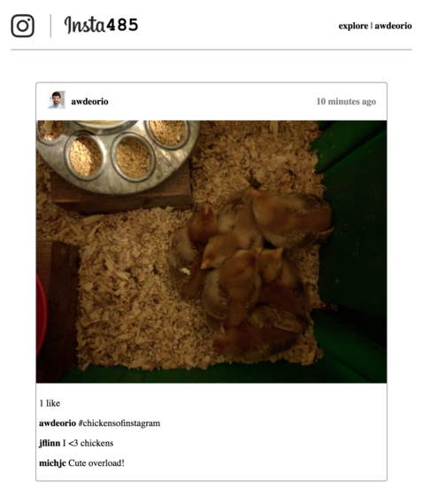
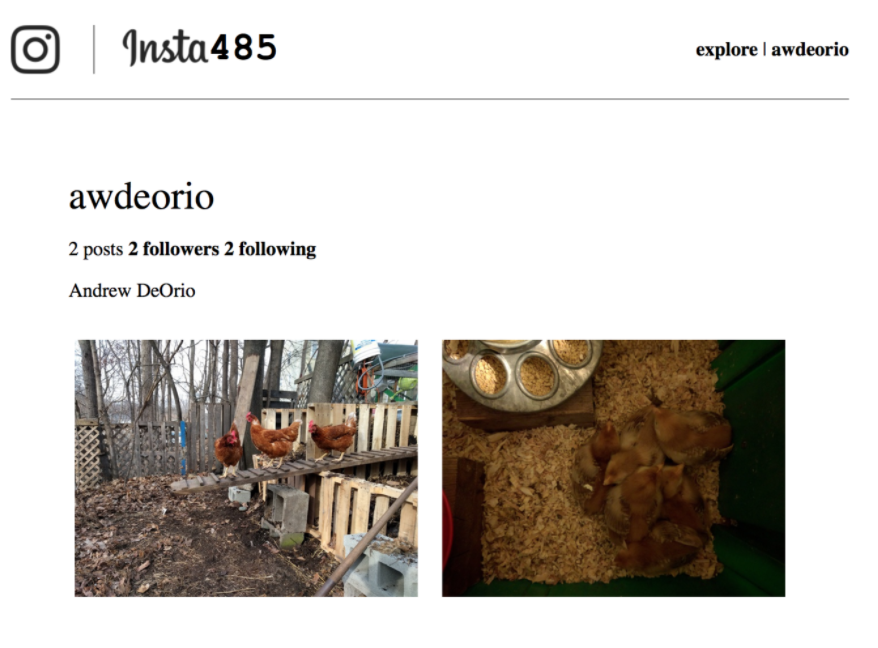

## Templated Static Site Generator

An Instagram clone implemented with a templated static site generator. This is the first of an EECS 485 three project sequence: a static site generator from templates, server-side dynamic pages, and client-side dynamic pages.

The learning goals of this project include HTML, CSS, templates, Python programming, and basic shell scripting. It is also a “readiness test” that will give you an idea of what EECS 485 will be like.

In this project, we write a Python program that takes as input HTML templates, JSON data and misc. static files (like images and CSS) and generates as output a web site of static content. 

